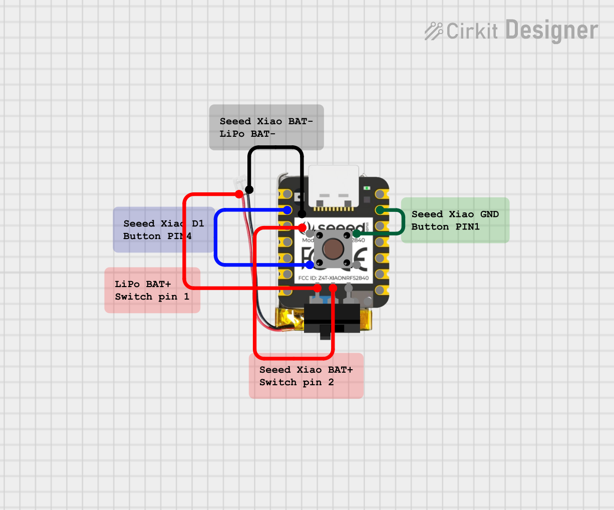

# Mutator 2000
Bluetooth Low Energy microphone mute button using Seeed Xiao BLE nRF52840. 
Wired headphones have the advantage of usually being equipped with a remote that allows you to control microphone muting. Wireless devices often have a physical button on the headphones, but it’s hard to locate quickly when needed, or it only works on the hardware level (not supporting system mute), so you can’t tell whether the mic is muted or not. That’s why the Mutator2000 was created — an ultra-mobile, super small and extremely simple remote to control microphone muting via Bluetooth. 😎


## Features

- 🎤 **One-button microphone mute** - Press to toggle microphone mute
- 🔋 **Battery monitoring** - Reports battery level via BLE Battery Service
- 💤 **Power saving** - Auto-sleep after 10 minutes of inactivity (only if not connected)
- 🔄 **Easy pairing reset** - delete pair from system and hold button during startup to switch into pairing mode
- 🎨 **LED status indicators**:
  - Cyan solid: Connected and ready
  - Cyan pulsing: Waiting for connection
  - Green pulsing: Pairing mode (bonding reset)
  - Red 3x flash: Entering sleep mode

## Hardware

- **Board**: Seeed Xiao BLE nRF52840 Sense
- **Power**: Li-Po 150mAh battery (rechargeable via USB-C)
- **Button**: Connected to pin 1 (built-in on Xiao)
- **Switch**: Connected between BAT+ on Xiao and B+ on battery
- **LED**: RGB LED (built-in)

## Wiring Diagram

```
Battery (+) ──── [Switch] ──── BAT (pin on Xiao)
Battery (-)  ──────────────── GND (pin on Xiao)

Button:
  - Pin 1 ──── D1 (GPIO 1)
  - Pin 2 ──── GND

Built-in RGB LED - status indicator
```


### Seeed Xiao BLE nRF52840 Pinout
- **D1 (GPIO 1)** - Mute button
- **RGB LED** - Status indicator (built-in)
- **BAT** - Battery power input
- **GND** - Ground

## Software Requirements

- Seeed NRF52 Board lib
- ArduinoBLE lib
- Arduino IDE

## Installation and Compilation

### Arduino IDE 

1. **Install Arduino IDE**
   - Download from https://www.arduino.cc/en/software

2. **Add Board Support Package**
   - File → Preferences → Additional Boards Manager URLs:
   - Add: `[https://adafruit.github.io/arduino-board-index/package_adafruit_index.json](https://files.seeedstudio.com/arduino/package_seeeduino_boards_index.json)`
   - Tools → Board → Boards Manager → search "Seeed nRF52 Boards" → Install

3. **Install libraries**
   - Sketch → Include Library → Manage Libraries
   - Install: **ArduinoBLE**

4. **Configuration**
   - **Board**: Tools → Board → Seeed nRF52 Boards → Seeed XIAO BLE - nRF52840
   - **Port**: Select appropriate COM/USB port
   - Open `Mutator2000.ino`
   - Upload (Ctrl+U)

## OS Configuration

### Windows 10/11
The device sends `Win + Alt + K` by default, which works natively on Windows 11 for microphone mute.

### Linux
Configure a custom keyboard shortcut:
```bash
# Set custom keybindings
gsettings set org.gnome.settings-daemon.plugins.media-keys.custom-keybindings "['/org/gnome/settings-daemon/plugins/media-keys/custom-keybindings/custom0/']"

# Configure the shortcut
gsettings set org.gnome.settings-daemon.plugins.media-keys.custom-keybinding:/org/gnome/settings-daemon/plugins/media-keys/custom-keybindings/custom0/ name 'Toggle Microphone Mute'
gsettings set org.gnome.settings-daemon.plugins.media-keys.custom-keybinding:/org/gnome/settings-daemon/plugins/media-keys/custom-keybindings/custom0/ command 'wpctl set-mute @DEFAULT_AUDIO_SOURCE@ toggle'
gsettings set org.gnome.settings-daemon.plugins.media-keys.custom-keybinding:/org/gnome/settings-daemon/plugins/media-keys/custom-keybindings/custom0/ binding '<Super><Alt>k'
```

### Alternative - Discord/Teams/Zoom
Most communication apps allow custom shortcuts for mute:
- **Discord**: User Settings → Keybinds → Toggle Mute
- **Teams**: Settings → Privacy → Keyboard shortcuts
- **Zoom**: Settings → Keyboard Shortcuts → Mute/Unmute My Audio

## Usage

1. **First time setup**: Pair the device via Bluetooth settings on your computer
2. **Normal operation**: Press the button to toggle microphone mute
3. **Reset pairing**: Hold the button while powering on (LED will flash green 3 times)
4. **Battery monitoring**: Battery level is reported automatically via Bluetooth

## Customization

### Change keyboard shortcut

Edit in `Mutator2000.ino`, lines 21-22:
```cpp
#define MUTE_KEY HID_KEY_K
#define MUTE_MODIFIERS (KEYBOARD_MODIFIER_LEFTGUI | KEYBOARD_MODIFIER_LEFTALT)
```

### Available HID keys
- `HID_KEY_M`, `HID_KEY_A`, `HID_KEY_B`, etc.
- `HID_KEY_F13` - `HID_KEY_F24` (rarely used, good for custom shortcuts)

### Modifiers
- `KEYBOARD_MODIFIER_LEFTCTRL`
- `KEYBOARD_MODIFIER_LEFTSHIFT`
- `KEYBOARD_MODIFIER_LEFTALT`
- `KEYBOARD_MODIFIER_LEFTGUI` (Windows/Super key)

## Power Management

Seeed Xiao BLE has built-in Li-Po battery charging:
- Charge via USB-C during use
- Battery voltage: 3.7V nominal (3.0V - 4.2V range)
- Current consumption: ~2mA (connected), ~1-2µA (deep sleep)
- Estimated runtime: 50-100 hours on 150mAh battery

## Troubleshooting

### Device won't connect
1. Make sure Bluetooth is enabled on computer
2. Check if device is paired (Settings → Bluetooth)
3. Remove device and pair again
4. Re-upload code with Serial Monitor enabled - check messages

### Button doesn't work
1. Check connections (D1 and GND)
2. Make sure device is connected (LED solid cyan)
3. Check Serial Monitor - should show "Mute toggled!"

### LED doesn't light up
- LED lights up only when device is connected via Bluetooth
- If Mutator2000 is connected to PC via USB cable check if it is not in file transfer mode
- Check battery power

### Reset doesn't work
- Make sure you hold the button **before** turning on power
- LED should flash green 3 times as confirmation

## Modifications

### Change connection timeout
```cpp
// In loop(), around line 230:
const unsigned long CONNECTION_TIMEOUT = 10 * 60 * 1000; // Change 10 minutes to desired value
```

## License

MIT License - open project, modify as needed!

## Contributing

Suggestions and pull requests are welcome!

---

**Author**: kmieciu2003  
**Date**: 2025-12-23  
**Version**: 1.0
